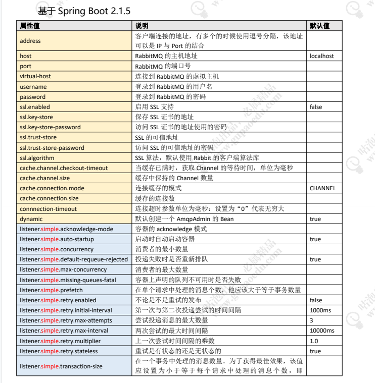
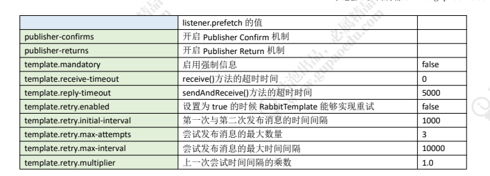
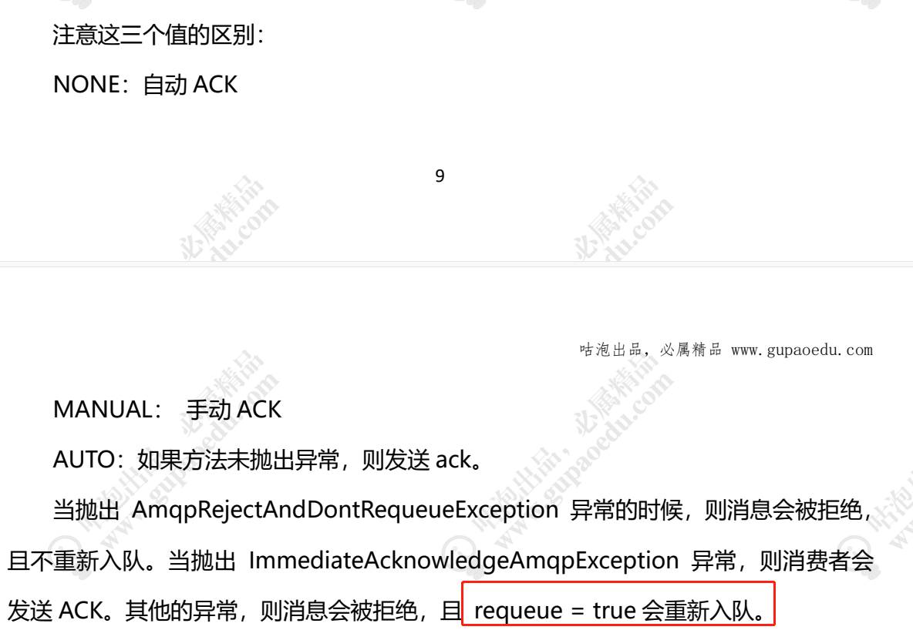

# xRabbitMQ


```
   		<!--mq-->
        <dependency>
            <groupId>org.springframework.boot</groupId>
            <artifactId>spring-boot-starter-amqp</artifactId>
        </dependency>
```


### RabbitMQ是一个开源的消息代理和队列服务器 基于AMQP协议

好处:  开源 性能优秀 稳定性保障

提供可靠性消息投递模式(confirm)  返回模式 (return)

与SpringAMQP完美整合 API 丰富

集群模式丰富，表达式配置，HA模式，镜像队列模型

保证数据不丢失的前提做到高可靠。可用性

### 高性能的原因：

Erlang语言最初在于交换机领域的架构模式，这样使得RabbitMQ在Broker之间进行数据交互的性能是非常优秀的

Erang的优点：有着和原生Socket一样的延迟

### AMQP高级消息队列协议

是一个规范

是具有现代性特征的二进制协议。是一个提供统一消息服务的应用层标准高级消息队列协议，是应用层协议的一个开发标准，为面向消息的中间件设计。

AMQP核心概念

**Server**:又称Broker,接受客户端的连接，实现AMQP实体服务

**Connection**：连接，应用程序与Broker的网络连接

**Channel**：网络信道，几乎所有的操作都在Channel中进行，Channel是进行消息读写的通道。客户端可创建多个Channel,每个Channel代表一个会话任务。

**Message**:消息，服务器和应用程序之间传送的数据，由Properties和Body组成。Properties可以对消息进行修饰，比如消息的优先级、延迟等高级特性；Body则是消息体内容。

**VirtualHost**: 虚拟地址，用于进行逻辑隔离，最上层的消息路由。一个Virtual Host 里面可以有诺干个 Exchange和 Queue, 同一个里面不能有相同名称的Exchange 或 Queue

**Exchange**:交换机，接收消息，根据路由键转发消息到绑定的队列  一个交换机可以绑定多个 Queue

**Bingding**: Exchange和Queue之间的虚拟连接，包含 routingKey

**Routing key**: 一个路由规则，虚拟机可用它来确定如何路由一个特定的消息

**Queue**:也称Message Queue,消息队列，保存消息并将它们转发给消费者


P(生产) ->{ exchange -> queue} -> c(消费)


Exchange  routing key

# 安装使用

官网地址 : http://www.rabbitma.com/

提前准备: 安装Linux必要依赖包

下载RabbitMQ 安装包

修改配置

```
准备：
yum install 
build-essential openssl openssl-devel unixODBC unixODBC-devel 
make gcc gcc-c++ kernel-devel m4 ncurses-devel tk tc xz

下载：
wget www.rabbitmq.com/releases/erlang/erlang-18.3-1.el7.centos.x86_64.rpm
wget http://repo.iotti.biz/CentOS/7/x86_64/socat-1.7.3.2-5.el7.lux.x86_64.rpm
wget www.rabbitmq.com/releases/rabbitmq-server/v3.6.5/


配置文件：
vim /usr/lib/rabbitmq/lib/rabbitmq_server-3.6.5/ebin/rabbit.app
比如修改密码、配置等等，例如：loopback_users 中的 <<"guest">>,只保留guest
服务启动和停止：
启动 rabbitmq-server start &
停止 rabbitmqctl app_stop

管理插件：rabbitmq-plugins enable rabbitmq_management
访问地址：http://192.168.11.76:15672/


rpm 安装顺序
rpm -ivh erlang-18.3-1.el7.centos.x86_64.rpm
socat-1.7.3.2-5.el7.lux.x86_64.rpm
rabbitmq-server-3.6.5-1.noarch.rpm
异常:

连接不上 请开启端口
firewall-cmd --add-port=15672/tcp --permanent
firewall-cmd --reload
 查看 开启端口 firewall-cmd --list-all
 lsof -i:15672

```


```
http://192.168.2.10:15672  管控台    5672 (java 通信端口号)25672  集群 通信端口号
```


# 命令行与管控台操作

```
rabbitmqctl stop_v rabbitmgctl stop app:关闭应用
rabbitmgctl start app:启动应用
rabbitmgctl status:节点状态
rabbitmgctl add user username password:添加用户
rabbitmgctl list users:列出所有用户
rabbitmgctl delete user username:删除用户
rabbitmgctl clear permissions-pⅦ hostpath username:清除用户权限
rabbitmgctl list user permissions username:列出用户权限
rabbitmgctl change password username newpassword:修改密码
rabbitmqctl set permissions-p Vhostpath username
*"".*""":设置用户权限
rabbitmgctl add vhost vhostpath:创建虚拟主机
rabbitmgctl list vhosts:列出所有虚拟主机
rabbitmgctl list permissions-pⅦ hostpath:列出虚拟主机上所有权限
rabbitmgctl delete vhost vhostpath:删除虚拟主机
rabbitmgcti list queues:查看所有队列信息
rabbitmgct- o vhostpath purge queue blue:清除队列里的消息

rabbitmgctl reset:移除所有数据,要在 abbitmgctI stop app之后使用
rabbitmgctl join cluster< clusternode>[-ram:组成集群命令
rabbitmgctl cluster status:查看集群状态

rabbitmqctl change cluster node type disc ram
修改集群节点的存储形式
rabbitmgctl forget cluster node[- offline忘记节点(摘除节点)
rabbitmgctl rename cluster node oldnode1 newnode 1 [oldnode2
[ newnode2.](修改节点名称)
```


交换机属性
Name:交换机名称
Type∶交换机类型 direct、 topIC、 fanout、 headers
Durability:是否需要持久化,true为持久化

Auto delete:当最后一个绑定到 Exchange上的队列删除后,自动删除该 Exchange
Internal:当前 Exchange是否用于 RabbitMO内部使用,默认为 False(不使用)
Arguments:扩展参数,用于扩展AMQP协议自制定化使用


Direct Exchange
所有发送到 Direct Exchange的消息被转发到 RouteKey中指定的 Queue
注意: Direct模式可以使用 RabbitMQ自带的 Exchange: default
Exchange,所以不需要将 Exchange进行任何绑定( binding)操作,消息传
递时, Routekey必须完全匹配才会被队列接收,否则该消息会被抛弃

交换机主要包括如下4种类型：

1. Direct exchange（直连交换机）
2. Fanout exchange（扇型交换机）
3. Topic exchange（主题交换机）
4. Headers exchange（头交换机）


# 代码使用

配置

```
spring: 
  rabbitmq:
    #    host: 192.168.1.107
    host: 192.168.2.10
    listener:
      simple:
        acknowledge-mode: manual
      type: simple
    password: guest
    port: 5672
    publisher-confirm-type: correlated
    requested-heartbeat: 5
    username: guest
    virtual-host: /skoyi
```


```
    @Data
    @Configuration
    @ConfigurationProperties(prefix = "skoyi.store.rabbit.order.cancel")
    public static class OrderCancelProperties {
        private String routing;
        private String queue;
        private String dlxRouting;
        private String dlxQueue;
    }
    
```

```
    @Bean
    public RabbitTemplate rabbitmqTemplate(ConnectionFactory connectionFactory) {
        RabbitTemplate rabbitTemplate = new RabbitTemplate(connectionFactory);
        rabbitTemplate.setConfirmCallback(notifyConfirmCallback);
        return rabbitTemplate;
    }
```


```
package com.ruigu.skoyi.store.manager.message;

import com.ruigu.skoyi.store.model.enums.MsgStatusEnum;
import com.ruigu.skoyi.store.repository.StoreMessageLogRepository;
import lombok.extern.slf4j.Slf4j;
import org.springframework.amqp.rabbit.connection.CorrelationData;
import org.springframework.amqp.rabbit.core.RabbitTemplate;
import org.springframework.beans.factory.annotation.Autowired;
import org.springframework.stereotype.Component;

import java.time.LocalDateTime;
import java.util.Objects;

/**
 * 消息confirm
 *
 */
@Component
@Slf4j
public class NotifyConfirmCallback implements RabbitTemplate.ConfirmCallback {

    /**
     * 默认等3次
     */
    private static final int WAIT_TIME = 3;


    @Autowired
    private StoreMessageLogRepository logRepository;


    @Override
    public void confirm(CorrelationData correlationData, boolean ack, String cause) {
        long msgId = Long.parseLong(Objects.requireNonNull(correlationData.getId()));
        if (ack) {
            log.info("消息:{},发送成功", msgId);
            int count = 0;
            try {
                while (count < WAIT_TIME) {
                    int row = logRepository.updateMsgLogStatus(msgId, MsgStatusEnum.SEND_SUCCESS.getCode());
                    if (row > 0) {
                        return;
                    }
                    count++;
                    Thread.sleep(500);
                }
            } catch (Exception e) {

            }
        } else {
            log.error("消息:{},发送失败,原因:{}", correlationData.toString(), cause);
            logRepository.updateMsgLogStatus(msgId, MsgStatusEnum.SEND_FAILURE.getCode());
        }
    }
}
```


```
    @Bean
    public TopicExchange exchange() {
        return new TopicExchange(storeProperties.getRabbit().getExchange());
    }
   ------------------------------------------------------------------------------- 
        @Bean
    public Queue orderCancelQueue() {
        Map<String, Object> arguments = new HashMap<>();
        arguments.put("x-dead-letter-exchange", storeProperties.getRabbit().getExchange());
        arguments.put("x-dead-letter-routing-key", orderCancelProp.getDlxRouting());
        return new Queue(orderCancelProp.getQueue(), true, false, false, arguments);
    }

    @Bean
    public Queue orderCancelDxlQueue() {
        return new Queue(orderCancelProp.getDlxQueue());
    }
       ------------------------------------------------------------------------------- 

        @Bean
    public Binding orderCancelDlxBinding() {
        return BindingBuilder.bind(orderCancelDxlQueue()).to(exchange()).with(orderCancelProp.getDlxRouting());
    }

    @Bean
    public Binding orderCancelBinding() {
        return BindingBuilder.bind(orderCancelQueue()).to(exchange()).with(orderCancelProp.getRouting());
    }
```

注解

```
    @RabbitListener(
            bindings = @QueueBinding(
                    exchange = @Exchange(value = "${skoyi.store.rabbit.exchange}", type = ExchangeTypes.TOPIC),
                    value = @Queue(value = "${skoyi.store.rabbit.yee-pay.queue}"),
                    key = "${skoyi.store.rabbit.yee-pay.routing}"
            )
    )
```











```
1、 消息队列的作用与使用场景？
要点：关键词+应用场景
2、 Channel 和 vhost 的作用是什么？
Channel：减少 TCP 资源的消耗。也是最重要的编程接口。
Vhost：提高硬件资源利用率，实现资源隔离。
3、 RabbitMQ 的消息有哪些路由方式？适合在什么业务场景使用？
Direct、Topic、Fanout
4、 交换机与队列、队列与消费者的绑定关系是什么样的？
多个消费者监听一个队列时（比如一个服务部署多个实例），消息会重复消
费吗？
多对多；
轮询（平均分发）
5、 无法被路由的消息，去了哪里？
直接丢弃。可用备份交换机（alternate-exchange）接收。
6、 消息在什么时候会变成 Dead Letter（死信）？
消息过期；消息超过队列长度或容量；消息被拒绝并且未设置重回队列
7、 如果一个项目要从多个服务器接收消息，怎么做？
如果一个项目要发送消息到多个服务器，怎么做？
定义多个 ConnectionFactory，注入到消费者监听类/Temaplate。
8、 RabbitMQ 如何实现延迟队列？
基于数据库+定时任务；
或者消息过期+死信队列；
或者延迟队列插件。

哪些情况会导致消息丢失？怎么解决？

16、 如何保证消息的顺序性？
一个队列只有一个消费者
17、 RabbitMQ 的集群节点类型？
磁盘节点和内存节点

动态增加消费者
SimpleMessagelistener container
18、 如何保证 RabbitMQ 的高可用？
HAProxy（LVS）+Keepalived
```


