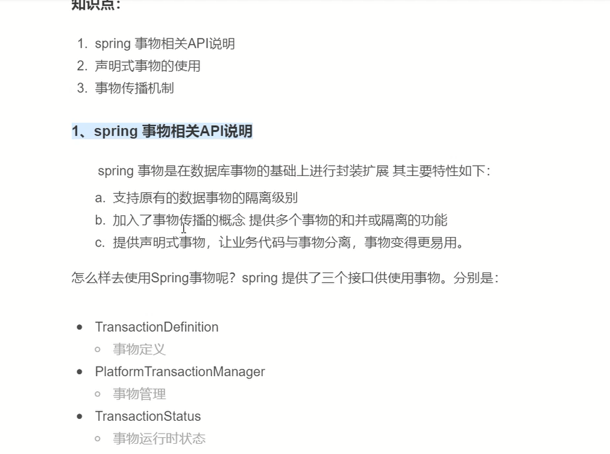
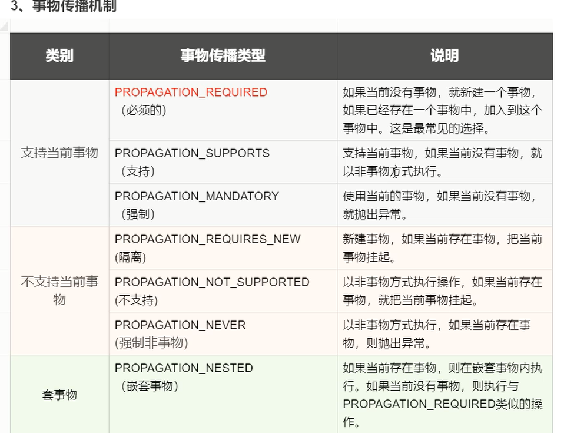
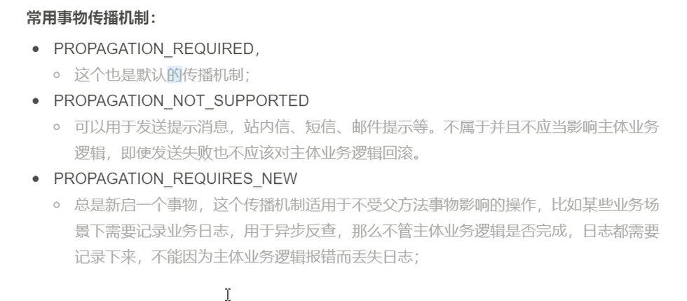
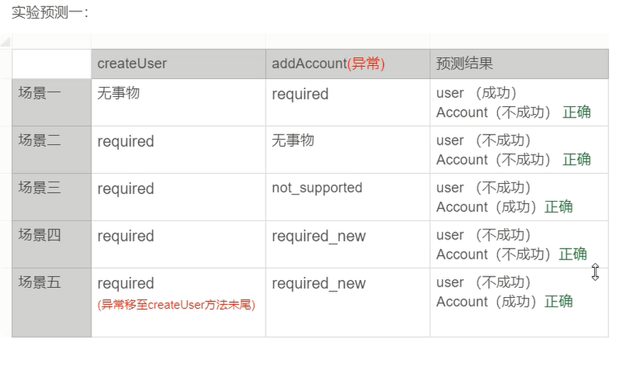
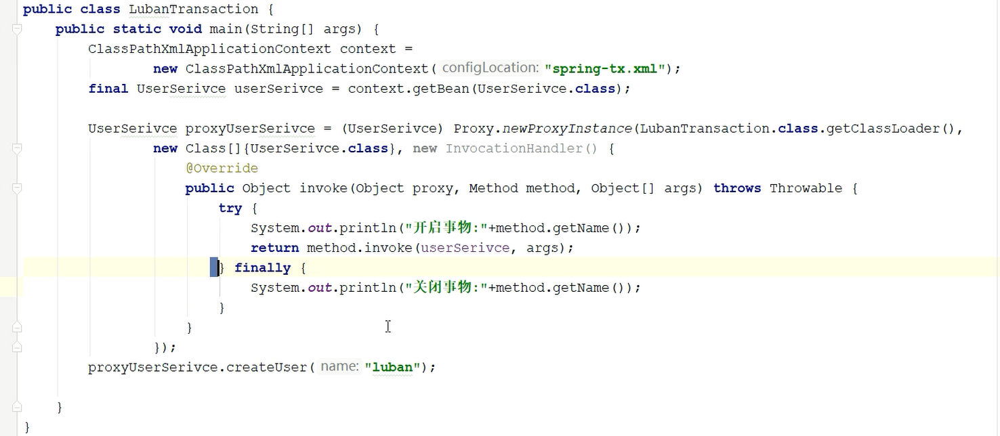
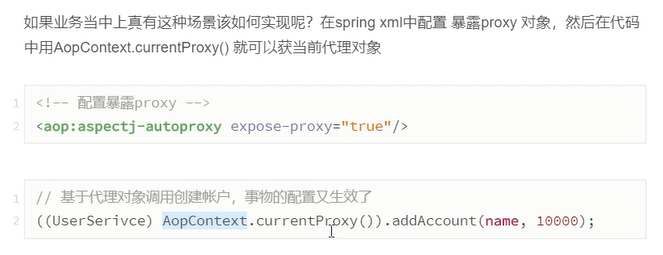
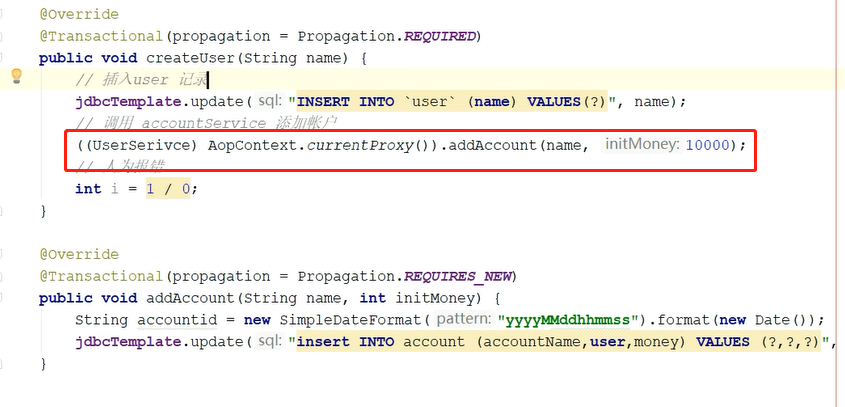

```

```




```
在@Transactional注解中如果不配置rollbackFor属性,那么事物只会在遇到RuntimeException的时候才会回滚,加上rollbackFor=Exception.class,可以让事物在遇到非运行时异常时也回滚如IOException、SQLException等以及用户自定义的Exception异常
```









动态代理




1.自己注入自己

2.






