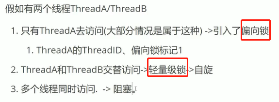
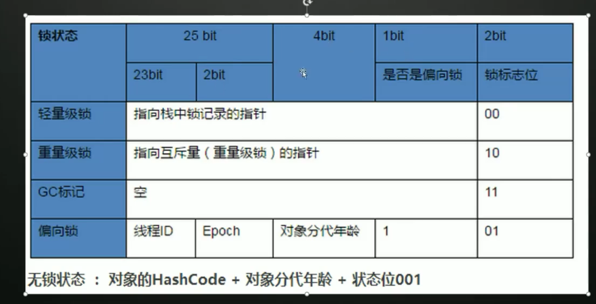
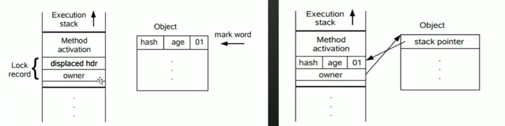
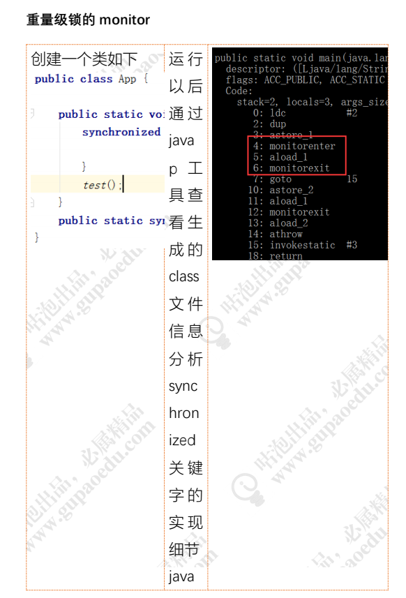
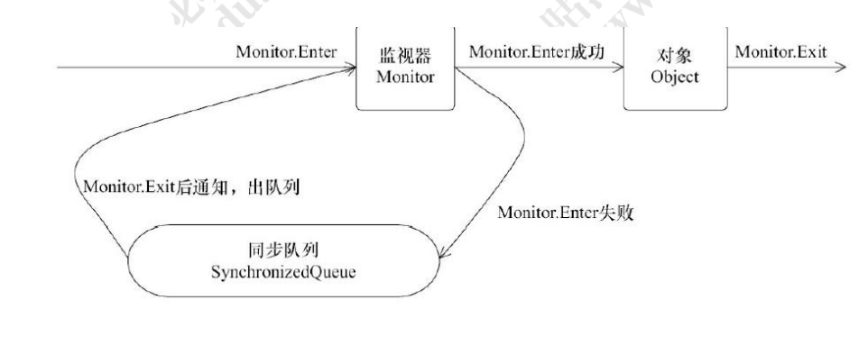
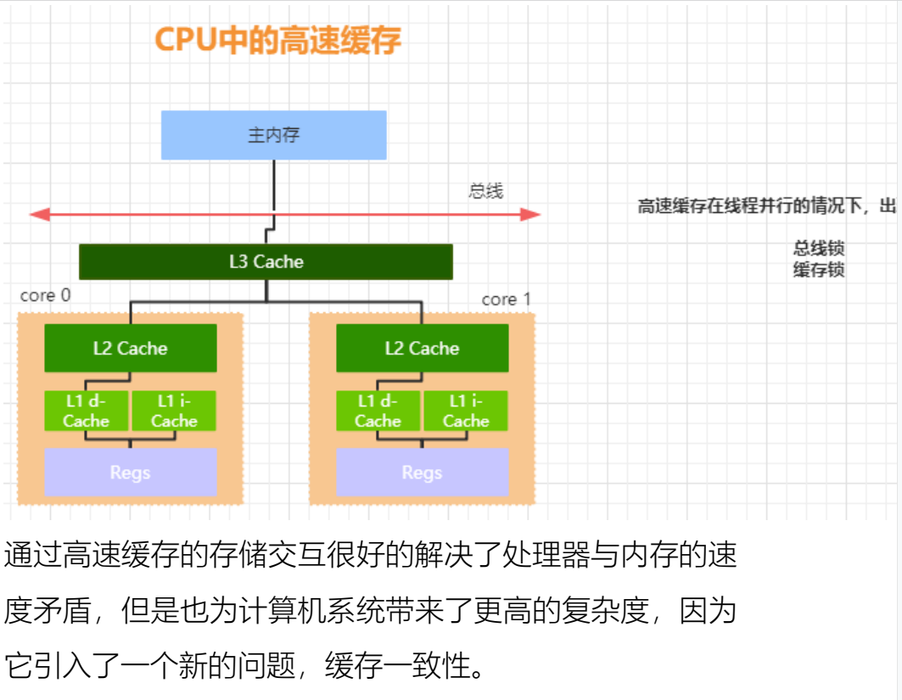
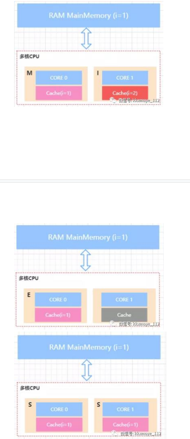
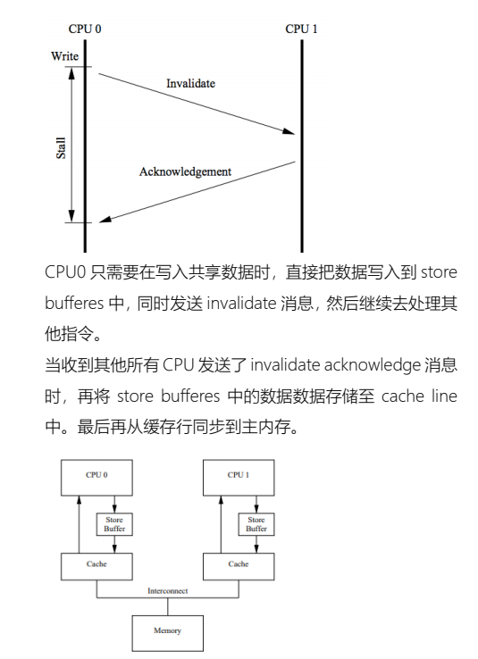
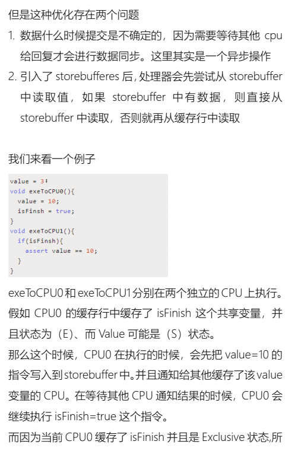
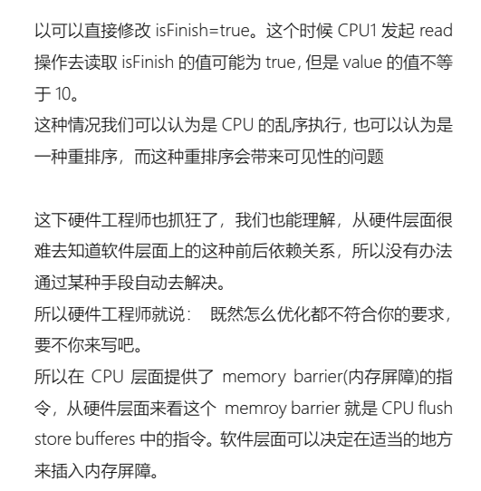

---
 @
---


一：synchronized和lock的区别
描述：每个对象都有一个内置锁，这是synchronized锁的基础，内置锁是互斥锁，可以实现同一时间只会有一个线程在执行逻辑代码

1：synchronized是关键字，是JVM层面的，lock是java类（接口）
2：synchronized不能够判断是否获取锁的状态，lock可以判断是否获取到锁
3：synchronized（隐式锁）可以自动释放锁（①：执行完同步代码时释放锁 ②：代码出现异常释放锁），lock（显示锁）需要手动在finally中释放锁（否则容易造成线程死锁）
4：synchronized修饰的线程A和线程B（同一个锁对象），当线程A在使用时，线程B等待，当线程A阻塞时，线程B一直等待，lock锁不一定会一直等待，如果在设置的超时时间内，尝试获取不到锁，线程可以不用等待就结束
5：synchronized是可重入，不可中断，非公平的，lock是可重入，可判断，公平的（也可以是非公平的）
6：synchronized锁适合同步少量代码，lock锁适合同步大量代码
7：使用上的区别：synchronized可以修饰普通方法（锁是当前实例对象），可以修饰静态方法（锁是当前实例的CLASS对象），可以修饰代码块（锁是括号中的实例对象），lock用来同步代码块，需要显示的调用lock()和unlock()方法来加锁和解锁
8：synchronized采用的CPU悲观锁机制，lock用的是乐观锁机制


CAS,compare and swap的缩写，中文翻译成比较并交换。

对CAS的理解，CAS是一种无锁算法，CAS有3个操作数，内存值V，旧的预期值A，要修改的新值B。当且仅当预期值A和内存值V相同时，将内存值V修改为B，否则什么都不做。


## 如何应用多线程

```
继承 Thread 类、
实现 Runnable 接口、
使用 ExecutorService、Callable、Future 实现带返回结果的多线程
ThreadPool
```


生命周期


yield:让出当前时间片


##  1.sleep() 方法和 wait() 方法区别和共同点?

|      |   sleep()    |             wait()             |
| :--: | :----------: | :----------------------------: |
|  1   |    Thread    |             Object             |
|  2   |   不释放锁   |             释放锁             |
|  3   |   自动唤醒   |      notify() notifyAll()      |
|  4   |   捕捉异常   |             不捕捉             |
|  5   |   任何地方   |           同步代码块           |
|  6   | 用于暂停执行 | Wait 通常被用于线程间交互/通信 |

# 2 线程和进程之间的区别

> 线程：系统分配处理器时间资源的基本单元，或者说进程之内独立执行的一个单元执行流。线程——程序执行的最小单位。
>
> 进程 指在系统中正在运行的一个应用程序；程序一旦运行就是进程；进程——资源分配的最小单位。
>
> 进程是资源分配的最小单位，线程是cpu调度的最小单位。


3  什么是多线程上下文切换

```
CPU通过分配时间片来执行任务，当一个任务的时间片用完，就会切换到另一个任务。在切换之前会保存上一个任务的状态，当下次再切换到该任务，就会加载这个状态。
——任务从保存到再加载的过程就是一次上下文切换。
```

什么时候会发生上下文切换？
按导致上下文切换的因素划分，可将上下文切换分为两点：

自发性上下文切换
非自发性上下文切换
自发性上下文切换指线程由于自身因素导致的切出。
通过调用下列方法会导致自发性上下文切换：

Thread.sleep()
Object.wait()
Thread.yeild()
Thread.join()
LockSupport.park()
非自发性上下文切换指线程由于线程调度器的原因被迫切出。
发生下列情况可能导致非自发性上下文切换：

**切出线程的时间片用完**
**有一个比切出线程优先级更高的线程需要被运行**
虚拟机的垃圾回收动作
上下文切换的开销
上下文切换的开销包括直接开销和间接开销。
直接开销有如下几点：

操作系统保存回复上下文所需的开销
线程调度器调度线程的开销
间接开销有如下几点：

处理器高速缓存重新加载的开销
上下文切换可能导致整个一级高速缓存中的内容被冲刷，即被写入到下一级高速缓存或主存


# 线程的生命周期


```
线程一共有 6 种状态（NEW、RUNNABLE、BLOCKED、
WAITING、TIME_WAITING、TERMINATED）
NEW：初始状态，线程被构建，但是还没有调用 start 方法
RUNNABLED：运行状态，JAVA 线程把操作系统中的就绪
	和运行两种状态统一称为“运行中”
BLOCKED：阻塞状态，表示线程进入等待状态,也就是线程
    因为某种原因放弃了 CPU 使用权，阻塞也分为几种情况
    ➢ 等待阻塞：运行的线程执行 wait 方法，jvm 会把当前
    线程放入到等待队列
    ➢ 同步阻塞：运行的线程在获取对象的同步锁时，若该同
    步锁被其他线程锁占用了，那么 jvm 会把当前的线程
    放入到锁池中
    ➢ 其他阻塞：运行的线程执行 Thread.sleep 或者 t.join 方
    法，或者发出了 I/O 请求时，JVM 会把当前线程设置
    为阻塞状态，当 sleep 结束、join 线程终止、io 处理完
    毕则线程恢复
TIME_WAITING：超时等待状态，超时以后自动返回
TERMINATED：终止状态，表示当前线程执行完毕
```


# 线程的启动原理 

 	```

```
1.线程的启动, start->基于针对不同的操作系统来实现不同的线程创建和启动指令 启动后会回调run()方法
2 interrupt(),线程终止
3可以通过 Thread.interrupted();/重置
4. interrupted Exception来进行重置 目的
```

```
interrupt 方法
当其他线程通过调用当前线程的 interrupt 方法，表示向当前线程打个招呼，告诉他可以中断线程的执行了，至于什
么时候中断，取决于当前线程自己。线程通过检查资深是否被中断来进行相应，可以通过isInterrupted()来判断是否被中断。
```

Thread.interrupted()

```
上面的案例中，通过 interrupt，设置了一个标识告诉线程可 以 终 止 了 ， 线 程 中 还 提 供 了 静 态 方 法
Thread.interrupted()对设置中断标识的线程复位。比如在上面的案例中，外面的线程调用 thread.interrupt 来设置中
断标识，而在线程里面，又通过 Thread.interrupted 把线程的标识又进行了复位
```

为什么要复位

```
Thread.interrupted()是属于当前线程的，是当前线程对外界中断信号的一个响应，表示自己已经得到了中断信号，
但不会立刻中断自己，具体什么时候中断由自己决定，让外界知道在自身中断前，他的中断状态仍然是 false，这就
是复位的原因。
```


   


```
我们看到调用start方法实际上是调用一个native方法start0()来启动一个线程
```

registerNatives 的 本 地 方 法 的 定 义 在 文 件
Thread.c,Thread.c 定义了各个操作系统平台要用的关于线
程的公共数据和操作，以下是 Thread.c 的全部内容

http://hg.openjdk.java.net/jdk8/jdk8/jdk/file/00cd9dc3c2b5/src/share/native/java/lang/Thread.c


从 这 段 代 码 可 以 看 出 ， start0() ， 实 际 会 执 行JVM_StartThread 方法，这个方法是干嘛的呢？ 从名字上
来看，似乎是在 JVM 层面去启动一个线程，如果真的是这样，那么在 JVM 层面，一定会调用 Java 中定义的 run 方法。那接下来继续去找找答案。我们找到 jvm.cpp 这个文件；这个文件需要下载 hotspot 的源码才能找到.


这个方法有两个参数，第一个是函数名称，线程创建成功
之后会根据这个函数名称调用对应的函数；第二个是当前
进程内已经有的线程数量。最后我们重点关注与一下
os::create_thread,实际就是调用平台创建线程的方法来创
建线程。
接下来就是线程的启动，会调用 Thread.cpp 文件中的
Thread::start(Thread* thread)方法，代码如下


# 线程的终止

Thread.interrupt() 方法

当其他线程通过调用当前线程的 interrupt 方法，表示向当前线程打个招呼，告诉他可以中断线程的执行了，至于什
么时候中断，取决于当前线程自己。线程通过检查资深是否被中断来进行相应，可以通过isInterrupted()来判断是否被中断。

# synchronized 的基本语法 

```
在多线程并发编程中 synchronized 一直是元老级角色，很多人都会称呼它为重量级锁。但是，随着 Java SE 1.6 对
synchronized 进行了各种优化之后，有些情况下它就并不那么重，Java SE 1.6 中为了减少获得锁和释放锁带来的性
能消耗而引入的偏向锁和轻量级锁.
```

synchronized 有三种方式来加锁，分别是

```
1. 修饰实例方法，作用于当前实例加锁，进入同步代码前要获得当前实例的锁
2. 修饰代码块，指定加锁对象，对给定对象加锁，进入同步代码库前要获得给定对象的锁。
3. 静态方法，作用于当前类对象加锁，进入同步代码前要 获得当前类对象的锁

不同的修饰类型，代表锁的控制粒度
```

```
1 public synchronize void test ();

2.1 public  void test (){
	synchronize(this) //代码块 当前实例(同一个对象) 与 1 一样   对象级别
or	synchronize(new Object()) //代码块 任何对象
}

2.2 public  void test (){
	synchronize(xxx.class) // 全局的
}

31 public static synchronize void test (); // 类级别 跨对象 

```


1 2 一样

3 4 一样

## 思考锁的存储

```
可以思考一下，要实现多线程的互斥特性，那这把锁需要哪些因素？
1. 锁需要有一个东西来表示，比如获得锁是什么状态、无锁状态是什么状态
2. 这个状态需要对多个线程共享
```


### 对象在内存中的布局 

```

```


```
当我们在 Java 代码中，使用 new 创建一个对象实例的时候，（hotspot 虚拟机）JVM 层面实际上会创建一个
instanceOopDesc 对象。Hotspot 虚拟机采用 OOP-Klass 模型来描述 Java 对象实例，OOP(Ordinary Object Point)指的是普通对象指针，Klass 用来描述对象实例的具体类型。Hotspot 采用instanceOopDesc 和 arrayOopDesc 来 描述对象 头，
arrayOopDesc 对象用来描述数组类型
instanceOopDesc 的定义在 Hotspot 源 码 中 的
instanceOop.hpp 文件中，另外，arrayOopDesc 的定义对应 arrayOop.hpp
```


## MarkWord 

```
在 Hotspot 中，markOop 的定义在 markOop.hpp 文件
Mark word 记录了对象和锁有关的信息，当某个对象被synchronized 关键字当成同步锁时，那么围绕这个锁的一
系列操作都和 Mark word 有关系。Mark Word 在 32 位虚 拟机的长度是 32bit、在 64 位虚拟机的长度是 64bit。
Mark Word 里面存储的数据会随着锁标志位的变化而变化，Mark Word 可能变化为存储以下 5 中情况
```


## 为什么任何对象都可以实现锁

每个对象都继承Object ,都有监视对象(monitor)

```
1. 首先，Java 中的每个对象都派生自 Object 类，而每个Java Object 在 JVM 内部都有一个 native 的 C++对象
oop/oopDesc 进行对应。
2. 线程在获取锁的时候，实际上就是获得一个监视器对象(monitor) ,monitor 可以认为是一个同步对象，所有的
Java 对象是天生携带 monitor。
多个线程访问同步代码块时，相当于去争抢对象监视器 修改对象中的锁标识,上面的代码中ObjectMonitor这个
对象和线程争抢锁的逻辑有密切的关系
```


## synchronized 锁的升级

过程

```
无锁: 默认
偏向锁: 一个线程进来,看mark word 是否偏向锁,无的话就偏向锁
轻量级锁: 另一个线程进来,mark word 有就升级,无就还是偏性锁
重量级锁: 在轻量级锁中自旋 10 次或者 自适应 monitor 核心(每个对象都有 阻塞)
```


```
在分析 markword 时，提到了偏向锁、轻量级锁、重量级锁。在分析这几种锁的区别时，我们先来思考一个问题
使用锁能够实现数据的安全性，但是会带来性能的下降。不使用锁能够基于线程并行提升程序性能，但是却不能保
证线程安全性。这两者之间似乎是没有办法达到既能满足性能也能满足安全性的要求。
hotspot 虚拟机的作者经过调查发现，大部分情况下，加锁的代码不仅仅不存在多线程竞争，而且总是由同一个线程
多次获得。所以基于这样一个概率，是的 synchronized 在JDK1.6 之后做了一些优化，为了减少获得锁和释放锁带来
的性能开销，引入了偏向锁、轻量级锁的概念。因此大家会发现在 synchronized 中，锁存在四种状态
分别是：无锁、偏向锁、轻量级锁、重量级锁； 
锁的状态根据竞争激烈的程度从低到高不断升级。
不可降级
```






### 偏向锁的基本原理

偏向锁的获取

```
1. 首先获取锁 对象的 Markword，判断是否处于可偏向状态。（biased_lock=1、且 ThreadId 为空）

2. 如果是可偏向状态，则通过 CAS 操作，需要检查 markword 中存储的ThreadID 是否等于当前线程的 ThreadID
a) 如果 cas 成功(相等)，那么 markword 就会变成这样。表示已经获得了锁对象的偏向锁，接着执行同步代码块
b) 如果 cas 失败，说明有其他线程已经获得了偏向锁，这种情况说明当前锁存在竞争，需要撤销已获得偏向
锁的线程，并且把它持有的锁升级为轻量级锁（这个操作需要等到全局安全点，也就是没有线程在执行字节码）才能执行

```

偏向锁的撤销

```
偏向锁的撤销并不是把对象恢复到无锁可偏向状态（因为偏向锁并不存在锁释放的概念），而是在获取偏向锁的过程
中，发现 cas 失败也就是存在线程竞争时，直接把被偏向的锁对象升级到被加了轻量级锁的状态。对原持有偏向锁的线程进行撤销时，原获得偏向锁的线程
有两种情况：
1. 原获得偏向锁的线程如果已经退出了临界区，也就是同
步代码块执行完了，那么这个时候会把对象头设置成无锁状态并且争抢锁的线程可以基于 CAS 重新偏向当前线程
2. 如果原获得偏向锁的线程的同步代码块还没执行完，处于临界区之内，这个时候会把原获得偏向锁的线程升级
为轻量级锁后继续执行同步代码块在我们的应用开发中，绝大部分情况下一定会存在 2 个以
上的线程竞争，那么如果开启偏向锁，反而会提升获取锁的资源消耗。所以可以通过 jvm 参数
UseBiasedLocking 来设置开启或关闭偏向锁
```


### 轻量级锁的基本原理


```
锁升级为轻量级锁之后，对象的 Markword 也会进行相应的的变化。升级为轻量级锁的过程：
1. 线程在自己的栈桢中创建锁记录 LockRecord。
2. 将锁对象的对象头中的MarkWord复制到线程的刚刚创建的锁记录中。
3. 将锁记录中的 Owner 指针指向锁对象。
4. 将锁对象的对象头的 MarkWord替换为指向锁记录的指
针。
```


#### 自旋锁

```
轻量级锁在加锁过程中，用到了自旋锁所谓自旋，就是指当有另外一个线程来竞争锁时，这个线
程会在原地循环等待，而不是把该线程给阻塞，直到那个获得锁的线程释放锁之后，这个线程就可以马上获得锁的。
注意，锁在原地循环的时候，是会消耗 cpu 的，就相当于在执行一个啥也没有的 for 循环。
所以，轻量级锁适用于那些同步代码块执行的很快的场景，这样，线程原地等待很短的时间就能够获得锁了。
自旋锁的使用，其实也是有一定的概率背景，在大部分同步代码块执行的时间都是很短的。所以通过看似无异议的
循环反而能提升锁的性能。但是自旋必须要有一定的条件控制，否则如果一个线程执
行同步代码块的时间很长，那么这个线程不断的循环反而
会消耗 CPU 资源。默认情况下自旋的次数是 10 次，可以通过 preBlockSpin 来修改
```

#### 自适应自旋锁

```
在 JDK1.6 之后，引入了自适应自旋锁，自适应意味着自旋的次数不是固定不变的，而是根据前一次在同一个锁上自
旋的时间以及锁的拥有者的状态来决定。如果在同一个锁对象上，自旋等待刚刚成功获得过锁，并
 
```

#### 轻量级锁的解锁

```
轻量级锁的锁释放逻辑其实就是获得锁的逆向逻辑，通过CAS 操作把线程栈帧中的 LockRecord 替换回到锁对象的
MarkWord 中，如果成功表示没有竞争。如果失败，表示当前锁存在竞争，那么轻量级锁就会膨胀成为重量级锁
```



```
分配空间复制到栈->>  锁对象的头 复制   owner 指向锁对象

```


### 重量级锁的基本原理    

```
当轻量级锁膨胀到重量级锁之后，意味着线程只能被挂起 阻塞来等待被唤醒了。
```




```
加了同步代码块以后，在字节码中会看到一个monitorenter 和 monitorexit。
每一个 JAVA 对象都会与一个监视器 monitor 关联，我们可以把它理解成为一把锁，当一个线程想要执行一段被
synchronized 修饰的同步方法或者代码块时，该线程得先获取到 synchronized 修饰的对象对应的 monitor。
monitorenter 表示去获得一个对象监视器。
monitorexit 表示释放 monitor 监视器的所有权，使得其他被阻塞的线程
可以尝试去获得这个监视器
monitor 依赖操作系统的 MutexLock(互斥锁)来实现的, 线程被阻塞后便进入内核（Linux）调度状态，这个会导致系
统在用户态与内核态之间来回切换，严重影响锁的性能
```

#### 重量级锁的加锁的基本流程



### 


```
任意线程对 Object（Object 由 synchronized 保护）的访问，首先要获得 Object 的监视器。如果获取失败，线程进
入同步队列，线程状态变为 BLOCKED。当访问 Object 的前驱（获得了锁的线程）释放了锁，则该释放操作唤醒阻
塞在同步队列中的线程，使其重新尝试对监视器的获取。
```


### 回顾线程的竞争机制 

```

加入有这样一个同步代码块，存在 Thread#1、Thread#2 等多个线程
synchronized (lock) {
 // do something
}
情况一：只有 Thread#1 会进入临界区；
情况二：Thread#1 和 Thread#2 交替进入临界区,竞争不激烈；
情况三：Thread#1/Thread#2/Thread3… 同时进入临界区，竞争激烈
偏向锁
此时当 Thread#1 进入临界区时，JVM 会将 lockObject 的
对象头 Mark Word 的锁标志位设为“01”，同时会用 CAS 操作把 Thread#1 的线程 ID 记录到 Mark Word 中，此时进
入偏向模式。所谓“偏向”，指的是这个锁会偏向于 Thread#1，若接下来没有其他线程进入临界区，则 Thread#1 再出入
临界区无需再执行任何同步操作。也就是说，若只有Thread#1 会进入临界区，实际上只有 Thread#1 初次进入
临界区时需要执行 CAS 操作，以后再出入临界区都不会有同步操作带来的开销。
轻量级锁
偏向锁的场景太过于理想化，更多的时候是 Thread#2 也会尝试进入临界区， 如果 Thread#2 也进入临界区但是
Thread#1 还没有执行完同步代码块时，会暂停 Thread#1并且升级到轻量级锁。Thread#2 通过自旋再次尝试以轻量
级锁的方式来获取锁
重量级锁
如果 Thread#1 和 Thread#2 正常交替执行，那么轻量级锁基本能够满足锁的需求。但是如果 Thread#1 和 Thread#2
同时进入临界区，那么轻量级锁就会膨胀为重量级锁，意味着 Thread#1 线程获得了重量级锁的情况下，Thread#2
就会被阻塞
```


```
前面我们在讲 synchronized 的时候，发现被阻塞的线程什
么时候被唤醒，取决于获得锁的线程什么时候执行完同步
代码块并且释放锁。那怎么做到显示控制呢？我们就需要
借 助 一 个 信 号 机 制 ： 在 Object 对 象 中 ， 提 供 了
wait/notify/notifyall，可以用于控制线程的状态
wait/notify/notifyall 基本概念 
wait：表示持有对象锁的线程 A 准备释放对象锁权限，释
放 cpu 资源并进入等待状态。
notify：表示持有对象锁的线程 A 准备释放对象锁权限，通
知 jvm 唤 醒 某 个 竞 争 该 对 象 锁 的 线 程 X 。 线 程 A 
synchronized 代码执行结束并且释放了锁之后，线程 X 直
接获得对象锁权限，其他竞争线程继续等待(即使线程 X 同
步完毕，释放对象锁，其他竞争线程仍然等待，直至有新
的 notify ,notifyAll 被调用)。
notifyAll：notifyall 和 notify 的区别在于，notifyAll 会唤醒
所有竞争同一个对象锁的所有线程，当已经获得锁的线程
A 释放锁之后，所有被唤醒的线程都有可能获得对象锁权
限需要注意的是：三个方法都必须在 synchronized 同步关键
字 所 限 定 的 作 用 域 中 调 用 ， 否 则 会 报 错
java.lang.IllegalMonitorStateException ，意思是因为没有
同步，所以线程对对象锁的状态是不确定的，不能调用这
些方法。
另外，通过同步机制来确保线程从 wait 方法返回时能够感
知到感知到 notify 线程对变量做出的修改
```

wait/notify 的基本原理


# Volatile


1. volatile

  ```
  volatile 可以使得在多处理器环境下保证了共享变量的可
  见性，那么到底什么是可见性呢？不知道大家有没有思考
  过这个问题
  在单线程的环境下，如果向一个变量先写入一个值，然后
  在没有写干涉的情况下读取这个变量的值，那这个时候读
  取到的这个变量的值应该是之前写入的那个值。这本来是
  一个很正常的事情。但是在多线程环境下，读和写发生在
  不同的线程中的时候，可能会出现：读线程不能及时的读
  取到其他线程写入的最新的值。这就是所谓的可见性
  为了实现跨线程写入的内存可见性，必须使用到一些机制
  来实现。而 volatile 就是这样一种机制
  ```

  

2. hsdis

  ```
  我们可以使用【hsdis】这个工具，来查看前面演示的这段代码的汇编指令，具体的使用请查看使用说明文档
  在运行的代码中，设置 jvm 参数如下
  【-server -Xcomp -XX:+UnlockDiagnosticVMOptions -
  XX:+PrintAssembly -XX:CompileCommand=compileonly,*App.*（替换成实际运行的代码）】
  然后在输出的结果中，查找下 lock 指令，会发现，在修改
  带有 volatile 修饰的成员变量时，会多一个 lock 指令。lock
  是一种控制指令，在多处理器环境下，lock 汇编指令可以
  基于总线锁或者缓存锁的机制来达到可见性的一个效果。
  为了让大家更好的理解可见性的本质，我们需要从硬件层
  面进行梳理
  ```

  

3. 3.可见性到底是什么?
  1.硬件层面
  2.jmm层面

    

  

```
一台计算机中最核心的组件是 CPU、内存、以及 I/O 设备。
在整个计算机的发展历程中，除了 CPU、内存以及 I/O 设
备不断迭代升级来提升计算机处理性能之外，还有一个非
常核心的矛盾点，就是这三者在处理速度的差异。CPU 的
计算速度是非常快的，内存次之、最后是 IO 设备比如磁盘。
而在绝大部分的程序中，一定会存在内存访问，有些可能
还会存在 I/O 设备的访问
为了提升计算性能，CPU 从单核升级到了多核甚至用到了
超线程技术最大化提高 CPU 的处理性能，但是仅仅提升
CPU 性能还不够，如果后面两者的处理性能没有跟上，意
味着整体的计算效率取决于最慢的设备。为了平衡三者的速度差异，最大化的利用 CPU 提升性能，从硬件、操作系
统、编译器等方面都做出了很多的优化
1. CPU 增加了高速缓存
2. 操作系统增加了进程、线程。通过 CPU 的时间片切换最
大化的提升 CPU 的使用率
3. 编译器的指令优化，更合理的去利用好 CPU 的高速缓存
然后每一种优化，都会带来相应的问题，而这些问题也是
导致线程安全性问题的根源。为了了解前面提到的可见性
问题的本质，我们有必要去了解这些优化的过程
CPU 高速缓存 
线程是 CPU 调度的最小单元，线程设计的目的最终仍然是
更充分的利用计算机处理的效能，但是绝大部分的运算任
务不能只依靠处理器“计算”就能完成，处理器还需要与内
存交互，比如读取运算数据、存储运算结果，这个 I/O 操
作是很难消除的。而由于计算机的存储设备与处理器的运
算速度差距非常大，所以现代计算机系统都会增加一层读
写速度尽可能接近处理器运算速度的高速缓存来作为内存
和处理器之间的缓冲：将运算需要使用的数据复制到缓存
中，让运算能快速进行，当运算结束后再从缓存同步到内
存之中。通过高速缓存的存储交互很好的解决了处理器与内存的速
度矛盾，但是也为计算机系统带来了更高的复杂度，因为
它引入了一个新的问题，缓存一致性。

```




## MESI 协议

```
MESI 表示缓存行的四种状态，分别是
1. M(Modify) 表示共享数据只缓存在当前 CPU 缓存中，并且是被修改状态，也就是缓存的数据和主内存中的数据不一致
2. E(Exclusive) 表示缓存的独占状态，数据只缓存在当前 CPU 缓存中，并且没有被修改
3. S(Shared) 表示数据可能被多个 CPU 缓存，并且各个缓 存中的数据和主内存数据一致
4. I(Invalid) 表示缓存已经失效
```




```
对于 MESI 协议，从 CPU 读写角度来说会遵循以下原则：
CPU 读请求：缓存处于 M、E、S 状态都可以被读取，I 状
态 CPU 只能从主存中读取数据
CPU 写请求：缓存处于 M、E 状态才可以被写。对于 S 状
态的写，需要将其他 CPU 中缓存行置为无效才可写
使用总线锁和缓存锁机制之后，CPU 对于内存的操作大概
可以抽象成下面这样的结构。从而达到缓存一致性效果
```

总结可见性的本质 

```
由于 CPU 高速缓存的出现使得 如果多个 cpu 同时缓存了
相同的共享数据时，可能存在可见性问题。也就是 CPU0 修
改了自己本地缓存的值对于 CPU1 不可见。不可见导致的
后果是 CPU1 后续在对该数据进行写入操作时，是使用的
脏数据。使得数据最终的结果不可预测。
很多同学肯定希望想在代码里面去模拟一下可见性的问题，
实际上，这种情况很难模拟。因为我们无法让某个线程指
定某个特定 CPU，这是系统底层的算法， JVM 应该也是
没法控制的。还有最重要的一点，就是你无法预测 CPU 缓
存什么时候会把值传给主存，可能这个时间间隔非常短，
短到你无法观察到。最后就是线程的执行的顺序问题，因
为多线程你无法控制哪个线程的某句代码会在另一个线程
的某句代码后面马上执行。
所以我们只能基于它的原理去了解这样一个存在的客观事实
了解到这里，大家应该会有一个疑问，刚刚不是说基于缓
存一致性协议或者总线锁能够达到缓存一致性的要求吗？
为什么还需要加 volatile 关键字？或者说为什么还会存在
可见性问题呢？
```

## MESI 优化带来的可见性问题

```
MESI 协议虽然可以实现缓存的一致性，但是也会存在一些
问题。
就是各个 CPU 缓存行的状态是通过消息传递来进行的。如
果 CPU0 要对一个在缓存中共享的变量进行写入，首先需
要发送一个失效的消息给到其他缓存了该数据的 CPU。并
且要等到他们的确认回执。CPU0 在这段时间内都会处于
阻塞状态。为了避免阻塞带来的资源浪费。在 cpu 中引入
了 Store Bufferes。
```










## CPU 层面的内存屏障 


## JMM

可见性原因 **缓存** 以及 **重排序**

```
JMM 全称是 Java Memory Model. 什么是 JMM 呢？
通过前面的分析发现，导致可见性问题的根本原因是 缓存 以及 重排序。 而 JMM 实际上就是提供了合理的禁用缓存
以及禁止重排序的方法。所以它最核心的价值在于解决可见性和有序性。

JMM 属于语言级别的抽象内存模型，可以简单理解为对硬件模型的抽象，它定义了共享内存中多线程程序读写操作
的行为规范：在虚拟机中把共享变量存储到内存以及从内存中取出共享变量的底层实现细节
通过这些规则来规范对内存的读写操作从而保证指令的正确性，它解决了 CPU 多级缓存、处理器优化、指令重排序
导致的内存访问问题，保证了并发场景下的可见性。需要注意的是，JMM 并没有限制执行引擎使用处理器的寄存器或者高速缓存来提升指令执行速度，也没有限制编译
器对指令进行重排序，也就是说在 JMM 中，也会存在缓存
一致性问题和指令重排序问题。只是 JMM 把底层的问题抽
象到 JVM 层面，再基于 CPU 层面提供的内存屏障指令，
以及限制编译器的重排序来解决并发问题
JMM 抽象模型分为主内存、工作内存；主内存是所有线程
共享的，一般是实例对象、静态字段、数组对象等存储在
堆内存中的变量。工作内存是每个线程独占的，线程对变
量的所有操作都必须在工作内存中进行，不能直接读写主
内存中的变量，线程之间的共享变量值的传递都是基于主
内存来完成
Java 内存模型底层实现可以简单的认为：通过内存屏障
(memory barrier)禁止重排序，即时编译器根据具体的底层
体系架构，将这些内存屏障替换成具体的 CPU 指令。对
于编译器而言，内存屏障将限制它所能做的重排序优化。
而对于处理器而言，内存屏障将会导致缓存的刷新操作。
比如，对于 volatile，编译器将在 volatile 字段的读写操作
前后各插入一些内存屏障。
```


# LOCK


查看 线程栈

```
// 查看java线程
jps
// 查看 线程栈
jstack pid

// 查看 指令
javap -v xxx.class
```

